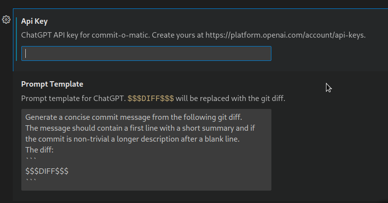

# commit-o-matic

https://user-images.githubusercontent.com/5400940/222413169-9e8c2bec-ed68-47e2-87b3-fdb1d2265a7a.mp4

This extension is a simple tool for automating the process of creating a Git commit messages using OpenAI's ChatGPT API. It sends your current git diff to ChatGPT and asks it to summarize the changes. The result is then pre-populated in the commit message box.

**WARNING:** This extension sends your git diff to an external API. It is not recommended to use this extension on sensitive repositories. It can break your NDA. 

## Install

You can install the extension from the [VS Code Marketplace](https://marketplace.visualstudio.com/items?itemName=alufers.commit-o-matic).

## Requirements

This extension requires an API key for ChatGPT. You can get one here: https://platform.openai.com/account/api-keys

Please note that the ChatGPT API is a paid service and you will need to give your credit card details to OpenAI. 

**WARNING:** You will be charged for each usage of the extension (it prints the cost in a message box after every time you use it).

The cost for moderately complex diffs is around half an US cent. The extension will issue a warning if the prompt is too long and the cost is likely to be higher than a few cents.

The OpenAI API is limited to 4096 tokens per request, so you should be billed a maxiumum of $0.0081 per one commit message. If your diff is too long, the extension will currently error out.

## Extension Settings

This extension contributes the following settings:

- `commit-o-matic.apiKey`: Your API key for ChatGPT
- `commit-o-matic.promptTemplate`: The template for the prompt sent to ChatGPT. `$$$DIFF$$$` will be replaced with the git diff.

## Contributing

Contributions are welcome. Please open an issue or a pull request.

To run the extension locally, clone the repository and run `npm install`.
Then open the folder in VS Code and press F5 to start a new window with the extension loaded.

## Disclaimer

This extension is not affiliated with OpenAI in any way. It is not endorsed by OpenAI or anyone officially involved in producing or managing ChatGPT.

THE SOFTWARE IS PROVIDED "AS IS", WITHOUT WARRANTY OF ANY KIND, EXPRESS OR IMPLIED, INCLUDING BUT NOT LIMITED TO THE WARRANTIES OF MERCHANTABILITY, FITNESS FOR A PARTICULAR PURPOSE AND NONINFRINGEMENT. IN NO EVENT SHALL THE AUTHORS OR COPYRIGHT HOLDERS BE LIABLE FOR ANY CLAIM, DAMAGES OR OTHER LIABILITY, WHETHER IN AN ACTION OF CONTRACT, TORT OR OTHERWISE, ARISING FROM, OUT OF OR IN CONNECTION WITH THE SOFTWARE OR THE USE OR OTHER DEALINGS IN THE SOFTWARE.

## License

MIT
